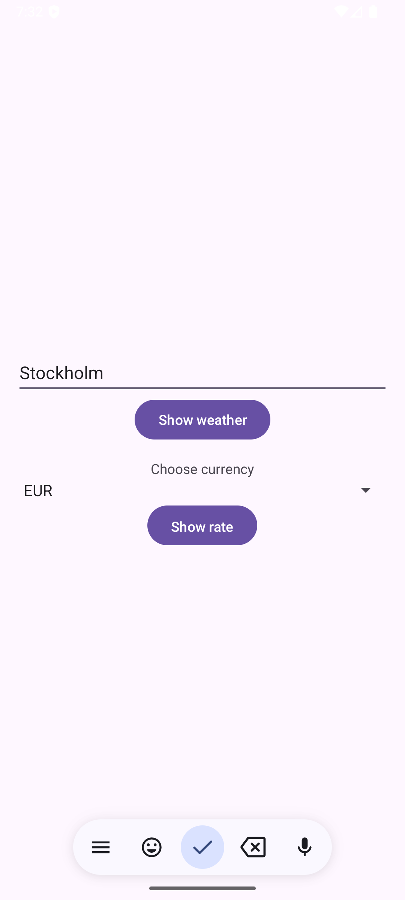

# Weather & Exchange

En liten, enkel Android-app där du kan:
- Logga in (demo): **username**: `abc` - **password**: `123`
- Söka väder för en valfri stad (temperatur och chans för regn just nu)
- Få en **notis** om regnchansen är **50 % eller mer**
- Se växelkurs **SEK > (EUR, USD, GBP, JPY, NOK, DKK)**

## Så använder du appen
1. **Logga in** med `abc / 123`.
2. På **Hub**:
   - Skriv en **stad** och tryck **Show weather** > du ser tid, temperatur och regnchans.
   - Välj en **valuta** i listan och tryck **Show rate** > du ser aktuell kurs från SEK.
3. I vyerna kan du gå **Back** till Hub, eller **Back to Home** för att logga ut och rensa backstack.

## Skärmbilder

    

## API:er
- Väder: **Open-Meteo** (geocoding + prognos)
- Valutor: **Frankfurter** (SEK > vald valuta)
- All kommunikation sker via **HTTPS**.

## Installation
- Öppna den signerade **APK**-filen på enheten och välj **Install**.
